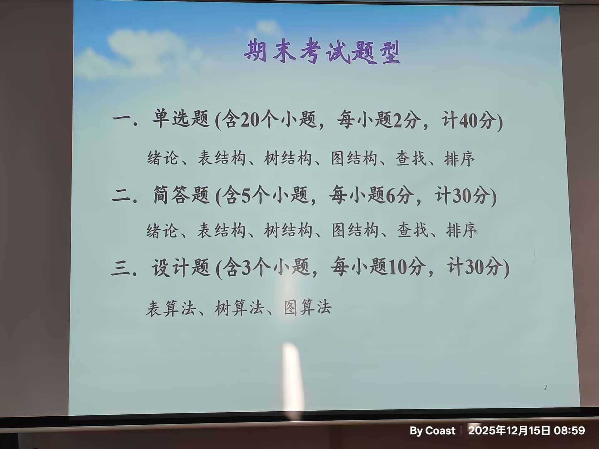

 ### 🟢 第一部分：必考代码与算法设计 (重点攻克 30分)

#### 1. 线性表 (表算法)[[list.cpp|线性表]]

- **知识点：** 单链表、顺序表的操作。
    
- **必练题目：**
    
    - 单链表的插入、删除节点（特别是头尾特殊处理）。
        
    - 单链表的**反转**（原地逆置）。
        
    - 两个有序链表的**合并**。
        
    - 查找链表的中间节点或倒数第K个节点。
        
- **掌握程度：** ⭐⭐⭐ **(会默写代码)**
    

#### 2. 树结构 (树算法)

- **知识点：** 二叉树的遍历与统计。
    
- **必练题目：**
    
    - **递归遍历**：前序、中序、后序（必须滚瓜烂熟）。
        
    - **统计**：计算二叉树的节点总数、叶子节点数、计算树的深度。
        
    - **非递归遍历**：特别是层次遍历（使用队列），有可能考中序非递归（使用栈）。
        
- **掌握程度：** ⭐⭐⭐ **(会默写核心递归函数)**
    

#### 3. 图结构 (图算法)

- **知识点：** 图的遍历是万变不离其宗的核心。
    
- **必练题目：**
    
    - **DFS (深度优先搜索)**：类似于树的先序，用来解决连通性问题。
        
    - **BFS (广度优先搜索)**：类似于树的层序，用来解决最短路径（无权图）问题。
        
    - **邻接表/邻接矩阵**：要会写结构体定义，并能写出基于这两种存储结构的遍历代码。
        
- **掌握程度：** ⭐⭐⭐ **(会默写DFS/BFS的标准模板)**
    

---

### 🔵 第二部分：手算模拟与过程推导 (简答题重点 30分)

**复习目标：** 给定数据，能画出每一步的变化过程，或者计算出最终指标。

#### 1. 图结构 (PPT图2重点)

- **最小生成树 (MST)：**
    
    - **Prim算法**：从一个点出发“加点”。
        
    - **Kruskal算法**：从小权值边开始“加边”（防环）。
        
    - **掌握程度：** ⭐⭐ (给一个图，能按顺序写出加入的边，或画出最终的树)
        
- **最短路径：**
    
    - **Dijkstra算法**：给出一个带权图，能画出更新距离的表格（路径长度的变化过程）。
        
    - **Floyd算法**：知道它是求多源最短路，能看懂简单的矩阵变化。
        
    - **掌握程度：** ⭐⭐ (会填表模拟Dijkstra过程)
        
- **拓扑排序 & 关键路径：**
    
    - **AOV网 (拓扑)**：能写出一个合法的拓扑序列。
        
    - **AOE网 (关键路径)**：**必考计算**。能计算Ve (最早发生), Vl (最迟发生), e (活动最早), l (活动最迟)，并找出关键路径。
        
    - **掌握程度：** ⭐⭐ (熟练计算Ve, Vl，找关键路径)
        

#### 2. 查找 (Search)

- **二分查找 (折半查找)：**
    
    - 给定一个有序序列，画出判定树，计算ASL（平均查找长度）。
        
    - **掌握程度：** ⭐⭐ (会画判定树，会算比较次数)
        
- **哈希表 (Hash)：**
    
    - **哈希函数**：除留余数法。
        
    - **冲突处理**：**线性探测法**（开放定址）和 **链地址法**（拉链）。
        
    - **掌握程度：** ⭐⭐ (给定一组数和Hash函数，能画出Hash表，并计算查找成功/失败的ASL)
        
- **平衡二叉树 (AVL) & 二叉排序树 (BST)：**
    
    - 给定序列，能画出构建BST的过程。
        
    - 理解AVL的四种旋转（LL, RR, LR, RL）逻辑，能画出旋转后的结果。
        

#### 3. 排序 (Sort) - PPT列了非常多

- **核心考法：** "请写出XX排序第一趟、第二趟...的结果"。
    
- **必掌握的手算排序：**
    
    - **插入排序** (直接插入、希尔排序-注意增量变化)。
        
    - **交换排序** (冒泡排序、**快速排序**-重点，考枢轴Pivot归位)。
        
    - **选择排序** (简单选择、**堆排序**-重点，要会画建堆和筛选过程)。
        
    - **归并排序** (特别是2路归并)。
        
    - **基数排序** (LSD，分配与收集)。
        
- **掌握程度：** ⭐⭐ (不要背代码，要拿纸笔模拟数字交换过程，特别是快排和堆排)
    

---

### 🟡 第三部分：概念与理论 (单选题 40分)

**复习目标：** 记忆定义、公式、时间复杂度。

- **绪论 & 概论：**
    
    - 时间复杂度分析（会看循环嵌套算Big O）。
        
    - 逻辑结构 vs 存储结构的区别。
        
- **树：**
    
    - 二叉树性质公式：
        
        ```
        n0=n2+1n0​=n2​+1
        ```
        
         (叶子数=度为2节点数+1)。
        
    - 完全二叉树的节点编号规律。
        
- **图：**
    
    - 连通分量、强连通分量概念。
        
    - 邻接矩阵的性质（出度、入度计算）。
        
- **排序与查找的性能分析 (死记硬背)：**
    
    - **稳定性**：哪些排序是不稳定的？(快、选、希、堆 -> 口诀：**快**些**选**一**堆**心情**不稳**定)。
        
    - **时间复杂度**：快排、归并、堆排是 
        
        ```
        O(nlog⁡n)O(nlogn)
        ```
        
        ；冒泡、插入、选择是 
        
        ```
        O(n2)O(n2)
        ```
        
        。
        

---

### 📅 复习时间规划建议

1. **Day 1 (代码攻坚)：** 专攻“设计题”。把链表反转、二叉树前序/层序遍历、图的DFS/BFS代码在电脑上敲一遍，或者在纸上默写直到没有语法错误。
    
2. **Day 2 (图论模拟)：** 专攻“简答题”中的图。找几个Dijkstra、最小生成树、关键路径的例题，盖住答案自己算一遍。
    
3. **Day 3 (排序与查找)：** 拿出一张白纸，写下一组乱序数字（如 45, 12, 53, ...），分别模拟快排、堆排、希尔排序的过程。复习Hash表的ASL计算。
    
4. **Day 4 (查漏补缺)：** 刷选择题，重点记忆时间复杂度和算法稳定性。
    

**特别提示：** 既然老师把“表、树、图”列为设计题，把“查找、排序”列为单独的篇章，**千万不要花时间去背“堆排序”或“平衡二叉树插入”的完整代码**，性价比极低！把时间花在理解它们的**操作步骤**上。